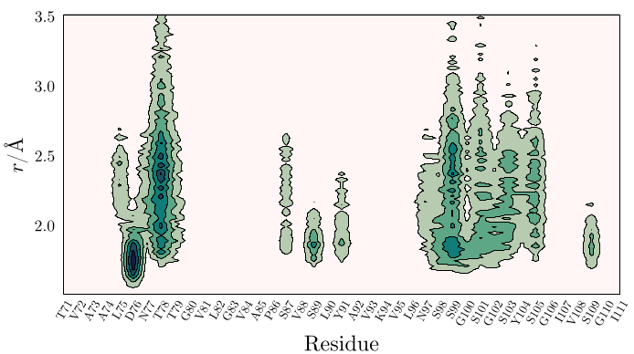

# 2D residue contribution density map

In this example we compute the density map of Glycerol in the vicinity of a set of residues of a protein, from the minimum-distance distribution function. 

The MDDF can be decomposed in the contributions of each atom of the solute or of the solvent. Here, we sum up te contributions of all the atoms of each residue of the solute, which is a protein, and plot a density map with the final information. The output figure obtained is:

<center>

</center>

## How to run this example:

1. Download and install [Julia](https://julialang.org).

2. Install all required packages. Within Julia, do:
```julia
julia> ] add ComplexMixtures, PDBTools, Plots, LaTeXStrings, Formatting
```

3. Get all files: 
```julia
git clone https://github.com/m3g/ComplexMixturesExamples
```

4. Run the example:
```julia
cd ComplexMixturesExamples/Density
julia density.jl
```

## Detailed explanation of the example:

Here, we use the `contourf` function of the `Plots` package of Julia. A detailed explanation of the input file `density.jl` is provide below: 


