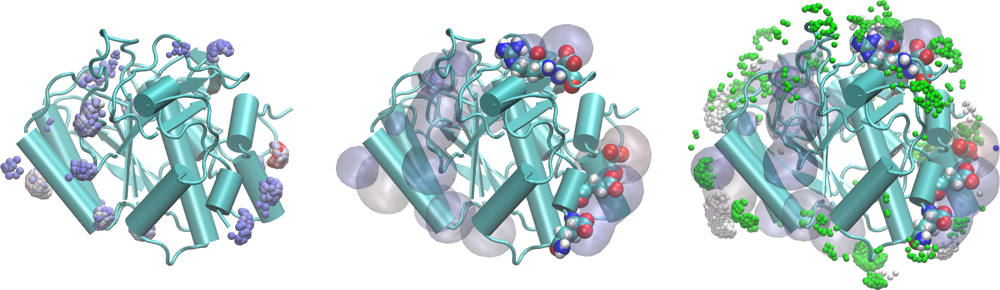

# 3D residue contribution density map

In this example we compute three-dimensional representations of the density map of Glycerol in the vicinity of a set of residues of a protein, from the minimum-distance distribution function. 

Here, the MDDF is decomposed at each distance according to the contributions of each *solute* residue. The grid is created such that, at each point in space around the protein, it is possible to identify:

1. Which atom is the closest atom of the solute to that point.

2. Which is the contribution of that atom (or residue) to the distribution function.

Therefore, by filtering the 3D density map at each distance one can visualize over the solute structure which are the regions that mostly interact with the solvent of choice at each distance. Typical images of such a density are:

A short tutorial video showing how to open the intput and output PDB files in VMD and produce images of the density is available at [this link](https://youtu.be/V4Py44IKDh8). 

<center>

</center>

In the figure on the left...

## How to run this example:

1. Download and install [Julia](https://julialang.org).

2. Install all required packages. Within Julia, do:
```julia
julia> ] add ComplexMixtures, PDBTools
```

(to exit Julia use `exit()` or `Control-d`

3. Get all files: 
```bash
git clone https://github.com/m3g/ComplexMixturesExamples
```

4. Run the example:
```bash
cd ComplexMixturesExamples/Density3D
julia density3D.jl
```

This will create (actually overwrite) the `grid.pdb` file. Here we provide a previously setup VMD session that contains the data with the visualization choices used to generate the figure above. Load it with:

```bash
vmd -e grid.vmd
``` 

## Detailed explanation of the example:

Here, we use the `contourf` function of the `Plots` package of Julia. A detailed explanation of the input file `density.jl` is provide below: 

### Loading packages that will be used:


```julia
using Plots
using LaTeXStrings
using Formatting
using ComplexMixtures, PDBTools
const CM = ComplexMixtures
```

### Some default options so the plot looks nice
```julia
plot_font = "Computer Modern"
default(fontfamily=plot_font,
        linewidth=2, framestyle=:box, label=nothing)
```

### Read the PDB file (using PDBTools)
```julia
pdb = readPDB("./system.pdb")
```

### Load results of the ComplexMixtures run
```julia
R = CM.load("./results_glyc50.json")  
```

### Define which are the solute molecules (the protein)
```julia
protein = select(pdb,"protein")
solute = CM.Selection(protein,nmols=1)
```

### Define which are the solvent molecules (Glycerol here)
```julia
glycerol = select(pdb,"resname GLYC")
solvent = CM.Selection(glycerol,natomspermol=14)
```

### Retrive the resiude contribution data

Collect which are the protein residues 
```julia
residues = collect(eachresidue(protein))
```

Set a matrix that will store the results, with a number of lines corresponding to the length of the MDDF histogram, and with a number of columns corresponding to the number of residues:
```julia
rescontrib = zeros(length(R.mddf),length(residues))
```

Now, collect the contribution of each residue as a column of the above matrix. The notation `pairs(residues)` returns tuples containg the index `ires` and the corresponding residue. The `.=` symbol sets each element of the corresponding column of the  `rescontrib` matrix to the output of `CM.contrib` (by broadcasting).  
```julia
for (ires,residue) in pairs(residues)
  rescontrib[:,ires] .= CM.contrib(solute,R.solute_atom,residue)
end
```

### Plot only for distances within 1.5 and 3.5:

Here, we will plot only the contributions from residue `70` to residue `110`, and from distances ranging from `1.5` to `3.5` which is where most of the action occurs:
```julia
irange=70:110
idmin = findfirst( d -> d > 1.5, R.d)
idmax = findfirst( d -> d > 3.5, R.d)
```

To obtain pretty labels for the residues in the x-axis, we retrive the one-letter residue names and concatenate them with the residue number converted to strings:

```julia
labels = PDBTools.oneletter.(resname.(residues)).*format.(resnum.(residues))
```

And, finally, we produce the plot, with a series of options that make this particular contour plot look nice:

```julia
contourf(irange,R.d[idmin:idmax],rescontrib[idmin:idmax,irange],
         color=cgrad(:tempo),linewidth=0.1,linecolor=:black,
         colorbar=:none,levels=5,
         xlabel="Residue",ylabel=L"r/\AA",
         xticks=(irange,labels[irange]),xrotation=60,
         xtickfont=font(6,plot_font),
         size=(500,280))
```

The final figure is saved as a `pdf` file:
```julia
savefig("./density.pdf")
```


