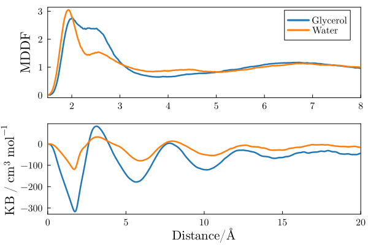
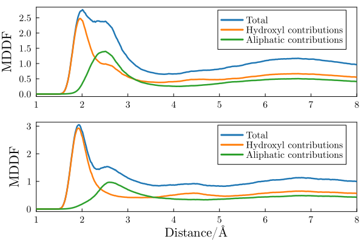

# ComplexMixtures.jl - Example

## Crowded solution of glycerol in water

This example illustrates the use of ComplexMixtures.jl to study the solution structure of a crowded (1:1 molar fraction) solution of glycerol in water. Here, we compute the distribution function and atomic contributions associated to the inter-species interactions (water-glycerol) and the glycerol-glycerol auto-correlation function. This example aims to illustrate how to obtain a detailed molecular picture of the solvation structures in an homogeneous mixture. 

The system simulated consists of 1000 water molecules (red) and 1000 glycerol molecules (purple).

The step by step of this example is split into running the MDDF calculation, in the [compute_mddf.jl](./compute_mddf.jl) file, and extracting the information and plotting, in the [plots.jl](./plots.jl) file. 

The trajectory file, required to run the `compute_mddf.jl` script, is avialble [here - 250Mb](https://drive.google.com/file/d/1BuXJ8AjBeduMSD2CkDJLDNxAAD2QNNg6/view?usp=sharing). The `plots.jl` script can be executed from the results saved in this repository. 

## Glycerol-Glycerol and Water-Glycerol distribution functions

The first and most simple analysis is the computation of the minimum-distance distribution functions between the componentes of the solution. In this example we focus on the distributions of the two componentes relative to the glycerol molecules. Thus, we display the glycerol auto-correlation function, and the water-glycerol correlation function in the first panel of the figure below. The second panel displays the KB integrals of the two componentes computed from each of these distributions. 

Both water and glycerol form hydrogen bonds with (other) glycerol molecules, as indicated by the peaks at ~1.8Angstroms. The auto-correlation function of glycerol shows a more marked second peak corresponding to non-specific interactions, which (as we will show) are likely associated to interactions of its aliphatic groups. 

The KB integrals in the second pannel show similar values water and glycerol, with the KB integral for water being slightly greater. This means that glycerol molecules are (sightly, if the result is considered reliable) preferentially hydrated from a macroscopic standpoint. 

## Glycerol group contributions to MDDFs

The distribution functions above can be decomposed into atomic and group contributions of the solutes or of the solvent molecules. Here we decompose the distributions into the contributions of the solute (glycerol in both cases) groups. We split glycerol into its hydroxyl and aliphatic groups. The first panel is the decomposition of the glycerol-glycerol correlation into glycerol group contributions, and the second panel is the decompostion of the water-glycerol correlation into glycerol group contributions. 

Not suprsingly the first peak of both distributions are associated with the interactions of each solvent at hydrogen bonding distances is associated with the glycerol hydroxyl groups. The second peaks of the distributions have important contributions of all groups, but notably of the aliphatic groups of glycerol. These interactions are stronger for the glycerol auto-correlation, resulting in the greater second peak of the MDDF. 

## 2D map of group contributions

The above distributions can be split into the contributions of each glycerol chemical group. The 2D maps below display this decomposition. 

The interesting result here is that the `CH` group of glycerol is protected from both solvents. There is a strong density augumentation at the vicinity of hydroxyl groups, and the second peak of the MDDFs is clearly associated to interactions with the `CH2` groups. 

## References

The system was built with [Packmol](http://m3g.iqm.unicamp.br/packmol).

The simulations were perfomed with [NAMD](https://www.ks.uiuc.edu/Research/namd/), with [CHARMM36](https://www.charmm.org) parameters. 

Density of mixture obtained from: https://doi.org/10.1016/j.petrol.2012.09.003