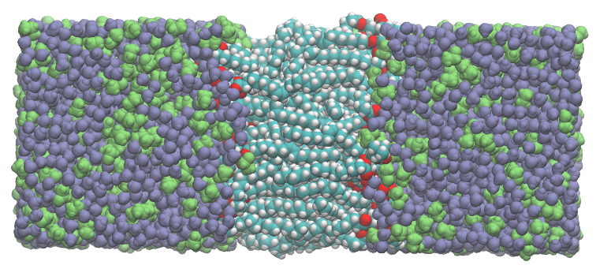

# ComplexMixtures.jl - Example

## POPC membrane solvated by water and ethanol

In this example ComplexMixtures.jl is used to study the interactions of a POPC membrane with a mixture of 20%(mol/mol) ethanol in water. At this concentration ethanol distabilizes the membrane. 

System image: a POPC membrane (center) solvated by a mixture of water (purple) and ethanol (green). The system is composed by 59 POPC, 5000 water, and 1000 ethanol molecules.  

## References

Membrane built with the VMD membrane plugin. 

Water and ethanol layers added with Packmol.

Density from: https://wissen.science-and-fun.de/chemistry/chemistry/density-tables/ethanol-water-mixtures/

