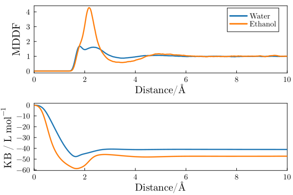
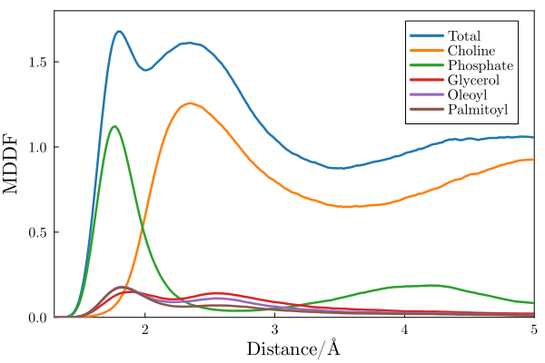
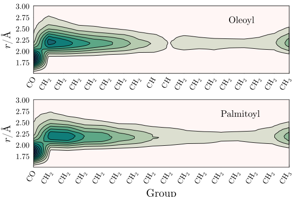
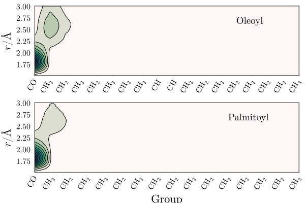

# ComplexMixtures.jl - Example

## POPC membrane solvated by water and ethanol

In this example ComplexMixtures.jl is used to study the interactions of a POPC membrane with a mixture of 20%(mol/mol) ethanol in water. At this concentration ethanol distabilizes the membrane. 

System image: a POPC membrane (center) solvated by a mixture of water (purple) and ethanol (green). The system is composed by 59 POPC, 5000 water, and 1000 ethanol molecules.  

The step by step of this example is split into running the MDDF calculation, in the [compute_mddf.jl](./compute_mddf.jl) file, and extracting the information and plotting, in the [plots.jl](./plots.jl) file. 

The trajectory file, required to run the `compute_mddf.jl` script, is avialble [here - 300Mb](https://drive.google.com/file/d/12TT5tblkFp1NtFOAQgjjGhmnYaXA8vQi/view?usp=sharing). The `plots.jl` script can be executed from the results saved in this repository. 

## Distribution functions and KB integrals 

Here we show the distribution functions and KB integrals associated to the solvation of the membrane by water and ethanol. The distribution functions are shown in the first panel of the figure below, and the KB integrals are shown in the second panel.  

Clearly, both water and ethanol accumulate on the proximity of the membrane. The distribution functions suggest that ethanol displays a greater local density augmentation, reaching concentrations roughly 4 times higher than bulk concentrations. Water has a peak at hydrogen-bonding distances (~1.8 Angstroms) and a secondary peak at 2.5Angs. 

Despite the fact that ethanol displays a gerater relative density (relative to its own bulk concentration) at short distances, the KB integral of water turns out to be greater (more positive) than that of ethanol. This implies that the membrane is preferentially hydrated. 

## Ethanol group contributions

The minimum-distance distribution function can be decomposed into the contributions of the ethanol molecule groups. In the figure below we show the contributions of the ethanol hydroxyl and aliphatic chain groups to the total MDDF. 

As expected, the MDDF at hydrogen-bonding distances is composed by contributions of the ethanol hydroxyl group, and the non-specific interactions at ~2.5Angs have a greater contribution of the aliphatic chain of the solvent molecules. It is interesting to explore the chemical complexity of POPC in what concerns these interactions.  

## Interaction of POPC groups with water

The MDDF can also be decomposed into the contributions of the solute atoms and chemical groups. First, we show the contributions of the POPC chemical groups to the water-POPC distribution. 

Not surprinsingly, water interactions occur majoritarily with the Phosphate and Choline groups of POPC molecules, that is, with the polar head of the lipid. The interactions at hydrogen-bonding distances are dominated by the phosphate group, and non-specific interaction occur mostly with the choline group. Some water molecules penetrate the membrane and interact with the glycerol and aliphatic chains of POPC, but these contributions are clearly secondary.

## Interaction of POPC groups with ethanol

The interactions of ethanol molecules with the membrane are more interesting, because ethanol penetrates the membrane. Here we decompose the ethanol-POPC distribution function into the contributions of the POPC chemical groups.

Ethanol molecules interact with the choline and phosphate groups of POPC molecules, as do water molecules. The contributions to the MDDF at hydrogen-bonding distances come essentialy from ethanol-phosphate interactions. 

However, ethanol molecules interact frequently with the glycerol and aliphatic chains of POPC. Interactions with the Oleoyl chain are slightly stronger than with the Palmitoyl chain. This means that ethanol penetrates the hydrophobic core of the membrane, displaying non-specific interactions with the lipids and with the glycerol group. These interactions are probably associated to the distabilizing role of ethanol in the membrane structure.   

## Ethanol interaction with the aliphatic chains

The MDDFs can be decomposed at more granular level, in which each chemical group of the aliphatic chains of the POPC molecules are considered independently. This allows the study of the penetration of the ethanol molecules in the membrane. In the figure below, the carbonyl following the glycerol group of the POPC molecules is represented in the left, and going to the right the aliphatic chain groups are sequentially shown. 

Ethanol displays an important density augumentation at the vincity of the carbonyl that follows the glycerol group, and accumulates on the proximity of the aliphatic chain. The density of ethanol decreases as one advances into the aliphatic chain, displaying a minimum around the insaturation in the Oleoyl chain. The terminal methyl group of both chains display a greater solvation by ethanol, suggesting the twisting of the aliphatic chain expose these terminal groups to membrane depth where ethanol is already abundant. 

The equivalent maps for water are strikingly different, and show that water is excluded from the interior of the membrane:

## References

Membrane built with the [VMD](https://www.ks.uiuc.edu/Research/vmd/) membrane plugin. 

Water and ethanol layers added with [Packmol](http://m3g.iqm.unicamp.br/packmol).

The simulations were perfomed with [NAMD](https://www.ks.uiuc.edu/Research/namd/), with [CHARMM36](https://www.charmm.org) parameters. 

Density of the ethanol-water mixture from: https://wissen.science-and-fun.de/chemistry/chemistry/density-tables/ethanol-water-mixtures/

