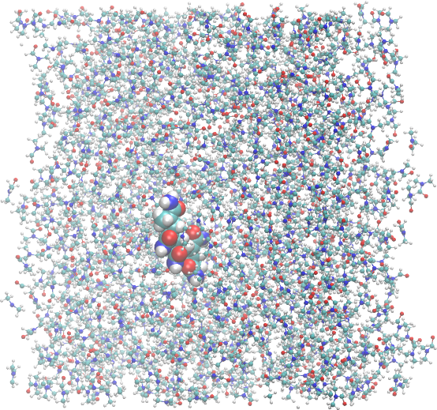
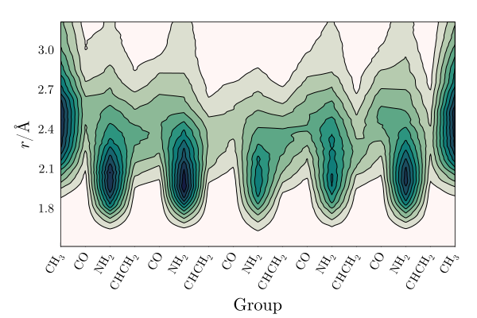

# ComplexMixtures.jl - Example

## Polyacrylamide in DMF

In this example we illustrate how the solvation structure of a polymer can be studied with ComplexMixtures.jl. The system is a 5-mer segment of polyacrylamide (PAE - capped with methyl groups), solvated with dimethylformamide (DMF). The system is interesting because of the different functional groups and polarities involved in the interactions of DMF with PAE. A snapshot of the system is shown below. 

The structures of DMF and of the polyacrylamide segment are:

<table><tr>
<td></td>
<td></td>
</tr>
<tr>
<td align=center>DMF</td>
<td align=center>Polyacrylamide</td>
</tr>
</table>

The system simulated consists of 2000 DMF molecules solvating a 5-mer chain of polyacrylamide. 

The step by step of this example is split into running the MDDF calculation, in the [compute_mddf.jl](./compute_mddf.jl) file, and extracting the information and plotting, in the [plots.jl](./plots.jl) file. 

The trajectory file, required to run the `compute_mddf.jl` script, is available [here - 275Mb](https://drive.google.com/file/d/1ug43ncCLsBATaJrT9zlbaqK6AORVvhhx/view?usp=sharing). The `plots.jl` script can be executed from the results saved in this repository. 

## Minimum-distance distribution function and KB integral

## Group contributions

## Solvation along the polymer chain

## References

Molecules built with JSME: B. Bienfait and P. Ertl, JSME: a free molecule editor in JavaScript, Journal of Cheminformatics 5:24 (2013)
http://biomodel.uah.es/en/DIY/JSME/draw.en.htm

The system was built with [Packmol](http://m3g.iqm.unicamp.br/packmol).

The simulations were perfomed with [NAMD](https://www.ks.uiuc.edu/Research/namd/), with [CHARMM36](https://www.charmm.org) parameters. 
