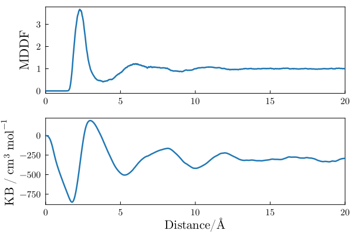

# ComplexMixtures.jl - Example

## Polyacrylamide in DMF

In this example we illustrate how the solvation structure of a polymer can be studied with ComplexMixtures.jl. The system is a 5-mer segment of polyacrylamide (PAE - capped with methyl groups), solvated with dimethylformamide (DMF). The system is interesting because of the different functional groups and polarities involved in the interactions of DMF with PAE. A snapshot of the system is shown below. 

Trajectory file: [traj_Polyacry.dcd - 275Mb](https://drive.google.com/file/d/1ug43ncCLsBATaJrT9zlbaqK6AORVvhhx/view?usp=sharing)

The structures of DMF and of the polyacrylamide segment are:

<table><tr>
<td></td>
<td></td>
</tr>
<tr>
<td align=center>DMF</td>
<td align=center>Polyacrylamide</td>
</tr>
</table>

## Minimum-distance distribution function and KB integral

## Group contributions

## Solvation along the polymer chain

## References

Molecules built with JSME:

B. Bienfait and P. Ertl, JSME: a free molecule editor in JavaScript, Journal of Cheminformatics 5:24 (2013)
http://biomodel.uah.es/en/DIY/JSME/draw.en.htm

System built with Packmol: 

