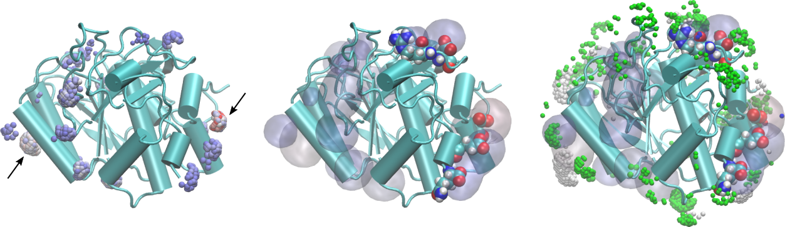

# 3D residue contribution density map

In this example we compute three-dimensional representations of the density map of Glycerol in the vicinity of a set of residues of a protein, from the minimum-distance distribution function. 

Here, the MDDF is decomposed at each distance according to the contributions of each *solute* (the protein) residue. The grid is created such that, at each point in space around the protein, it is possible to identify: 

1. Which atom is the closest atom of the solute to that point.

2. Which is the contribution of that atom (or residue) to the distribution function.

Therefore, by filtering the 3D density map at each distance one can visualize over the solute structure which are the regions that mostly interact with the solvent of choice at each distance. Typical images of such a density are:

<center>

</center>

In the figure on the left, the points in space around the protein are selected with the following properties: distance from the protein smaller than 2.0Å and relative contribution to the MDDF at the corresponding distance of at least 10% of the maximum contribution. Thus, we are selecting the regions of the protein corresponding to the most stable hydrogen-bonding interactions. The color of the points is the contribution to the MDDF, from blue to red. Thus, the most redish-points corresponds to the regions where the most stable hydrogen bonds were formed. We have marked two regions here, on opposite sides of the protein, with arrows.

Clicking on those points we obtain which are the atoms of the protein contributing to the MDDF at that region. In particular, the arrow on the right points to the strongest red region, which corresponds to an Aspartic acid. These residues are shown explicitly under the density (represented as a transparent surface) on the figure in the center.

The figure on the right displays, overlapped with the hydrogen-bonding residues, the most important contributions to the second peak of the distribution, corresponding to distances from the protein between 2.0 and 3.5Å. Notably, the regions involved are different from the ones forming hydrogen bonds, indicating that non-specific interactions with the protein (and not a second solvation shell) are responsible for the second peak. 

A short tutorial video showing how to open the intput and output PDB files in VMD and produce images of the density is available here: 

<center>
<a target=_newpage_ href=https://youtu.be/V4Py44IKDh8>

</a>
</center>

## How to run this example:

1. Download and install [Julia](https://julialang.org).

2. Install all required packages. Within Julia, do:
```julia
julia> ] add ComplexMixtures, PDBTools
```

(to exit Julia use `exit()` or `Control-d`

3. Get all files: 
```bash
git clone https://github.com/m3g/ComplexMixturesExamples
```

4. Run the example:
```bash
cd ComplexMixturesExamples/Density3D
julia density3D.jl
```

Alternatively, open Julia and copy/paste or the commands in `density3D.jl` or use `include("./density3D.jl")`. These options will allow you to remain on the Julia section with access to the `grid` data structure that was generated and corresponds to the output `grid.pdb` file. 

This will create (actually overwrite) the `grid.pdb` file. Here we provide a previously setup VMD session that contains the data with the visualization choices used to generate the figure above. Load it with:

```bash
vmd -e grid.vmd
``` 

## Detailed explanation of the example:

Initially we load the `ComplexMixtures` and `PDBTools` packages:

```julia
using ComplexMixtures, PDBTools
```

Then we define an alias for `ComplexMixtures`, to make the name shorter:
```
const CM = ComplexMixtures
```


With the `readPDB` function of `PDBTools`, we read the  PDB file of the system simulated:
```julia
pdb = readPDB("../Data/system.pdb")
```

and using `ComplexMixtures`, we load the results from the calculation of the MDDF of Glycerol around the protein, which was computed previously:
```julia
R = CM.load("../Data/results_glyc50.json")  
```

The solute here is the protein, and we need to setup the structures that define which atoms and type of solute it is. First, we select from the atoms of the pdb file of the system, those belonging to the protein, using `select` from `PDBTools`:
```julia
protein = select(pdb,"protein")
```

and then we define the solute structure that is actually used in `ComplexMixtures`, by passing those atoms and specifying that the solute is a single molecule to the `Selection` function of `ComplexMixtures`:
```julia
solute = CM.Selection(protein,nmols=1)
```

The 3D grid representing the density around the protein is computed with the `grid3D` function provided by `ComplexMixtures`. It receives the `solute` structure (of type `CM.Selection`), the list of solute atoms (of type `PDBTools.Atoms`, as the `protein` selection above), the name of the output file and some optional parameters to define the grid. Here we compute the grid only between 1.5 and 3.5Å, characterizing the first and second solvation shells. The grid has by default a `step` of 0.5Å. 

```julia
grid = CM.grid3D(solute=solute,
                 solute_atoms=protein,
                 mddf_result=R,
                 output_file="grid.pdb",
                 dmin=1.5,dmax=3.5)
```

The command above will generate the grid, save it to `grid.pdb` and let it available in the `grid.pdb` array of atoms, for further inspection, if desired. 

By changing `dmin`, `dmax`, and `step`, one controls the grid size and resolution. This may generate very large output files.
                                                                                                      


