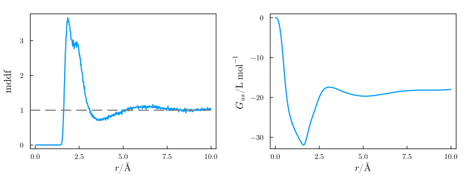
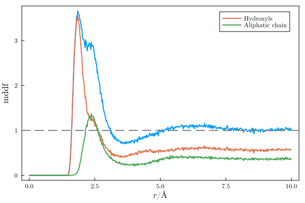

# Minimum-Distance Distribuion function

## Here we compute the minimum-distance distribution function, the Kirkwood-Buff integral, and the atomic contributions of the solvent to the density.

This example illustrates the regular usage of `ComplexMixtures`, to compute the minimum distance distribution function, KB-integrals and group contributions. 

## How to run this example:

1. Download and install [Julia](https://julialang.org)

2. Install the required packages. Within Julia, do:
```julia
julia> ] add ComplexMixtures, PDBTools, Plots, LaTeXStrings
```

3. Get the files:
```bash
git clone https://github.com/m3g/ComplexMixturesExamples
```

4. Run this example:
```bash
cd ComplexMixturesExamples/MDDF
julia -e mddf.jl
```

By default, a short trajectory sample is used, but the results are loaded from a previous calculation
on the full trajectory. To run the calculations on the complete trajectory, first download the file
from [here](https://drive.google.com/file/d/14M30jDHRwUM77hzbDphgbu8mcWFBcQrX/view?usp=sharing) (3GB file), and
place it in the `test/trajectories` directory.

## Detailed explanation of the example:

Loading the packages required for computing the MDDF.  

```julia
using PDBTools
using ComplexMixtures
```

Load the pdb file of the system using `PDBTools`:
```julia
atoms = readPDB("../Data/system.pdb")
```

Create arrays of atoms with the protein and Glycerol atoms, using the `select` function of the `PDBTools` package:
```julia
protein = select(atoms,"protein")
glyc = select(atoms,"resname GLYC")
```

Setup solute and solvent structures, required for computing the MDDF, with `Selection` function of the `ComplexMixtures` package:
```julia
solute = Selection(protein,nmols=1)
solvent = Selection(glyc,natomspermol=14)
```

Read and setup the Trajectory structure required for the computations:
```julia
trajectory = Trajectory("../Data/glyc50.dcd",solute,solvent)
```

Run the calculation and get results:
```julia
results = mddf(trajectory)
```

Save the reults to recover them later if required
```julia
save(results,"./glyc50.json")
```

The trajectory that was loaded was for a toy-example. The complete trajectory is available [here](https://drive.google.com/file/d/14M30jDHRwUM77hzbDphgbu8mcWFBcQrX/view?usp=sharing), but it is a 3GB file. The same procedure above was performed with that file and produced the `results_Glyc50.json` file, which is available in the Data directory here. We will continue with this file instead. 

Load the actual results obtained with the complete simulation:
```julia
results = load("../Data/results_glyc50.json")
```

Results are loaded, and now we can plot the data obtained.

## Produce plots

### MDDF and Kirkwood-Buff integrals

Load some packages that we will use to produce the plots:
```julia
using Plots, Plots.PlotMeasures, LaTeXStrings
```

Some default options that make the plots prettier:
```julia
default(fontfamily="Computer Modern",
        linewidth=2, framestyle=:box, label=nothing, grid=false)
```

First, we will plot the MDDF and the corresponding Kirkwood-Buff integral, which are available in the `results.mddf` and `results.kb` fields of the `results` data set. The distances are available in the `results.d` vector. We also plot here an horizontal line and save the figure as a `pdf` file.  

```julia
plot(layout=(1,2))
plot!(results.d,results.mddf,
      xlabel=L"r/\AA",ylabel="MDDF",subplot=1)
hline!([1],linestyle=:dash,linecolor=:gray,subplot=1)
plot!(results.d,results.kb/1000, #to L/mol
      xlabel=L"r/\AA",ylabel=L"G_{us}/\mathrm{L~mol^{-1}}",subplot=2)
plot!(size=(800,300),margin=4mm)
savefig("./mddf.pdf")
```

This will produce the following plot:



### Atomic contributions to the MDDF

Selecting the atoms corresponding to the hydroxyl groups, and of the aliphatic carbons of Glycerol. Here we list the types of the atoms as specified by the force-field.
```julia
hydroxyls = ["O1","O2","O3","H1","H2","H3"]
aliphatic = ["C1","C2","HA","HB","HC","HD"]
```

The `contrib` function of `ComplexMixtures` will extract from the result the contributions of each set of atoms to the total MDDF:

```julia
hydr_contrib = contrib(solvent,results.solvent_atom,hydroxyls)
aliph_contrib = contrib(solvent,results.solvent_atom,aliphatic)
```

And, finally, here we plot these group contributions on top of the total MDDF:

```julia
plot(results.d,results.mddf,xlabel=L"r/\AA",ylabel="MDDF",size=(600,400))
plot!(results.d,hydr_contrib,label="Hydroxils")
plot!(results.d,aliph_contrib,label="Aliphatic chain")
hline!([1],linestyle=:dash,linecolor=:gray)
savefig("./mddf_atom_contrib.pdf")
```

This will produce the following figure:



Note how hydroxyl clearly are the sole contribution to the peak at ~1.9 Angstroms, corresponding to hydrogen-bonding interactions. The aliphatic groups contribute importantly to the shoulder at larger distances, which correspond to non-specific interactions. 


