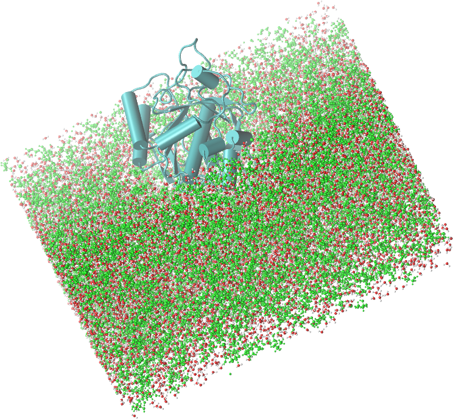
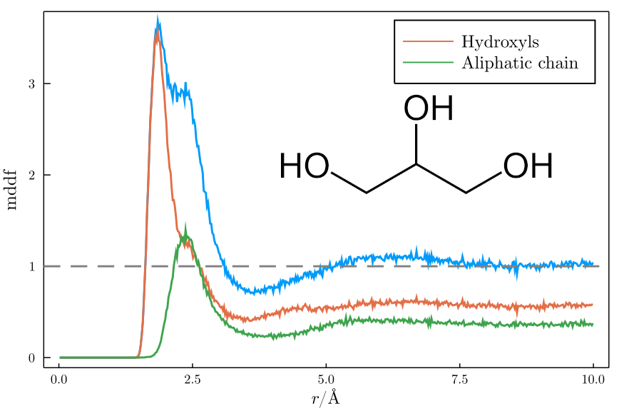

# ComplexMixturesExamples
### Examples provided for the ComplexMixtures package.

The following examples consider a system composed a protein solvated by a mixture of water and glycerol, built with [Packmol](http://m3g.iqm.unicamp.br/packmol). The simulations were perfomed with [NAMD](https://www.ks.uiuc.edu/Research/namd/) with periodic boundary conditions and a NPT ensemble at room temperature and pressure. Molecular pictures were produced with [VMD](https://www.ks.uiuc.edu/Research/vmd/) and plots were produced with [Julia](https://julialang.org)'s [Plots](http://docs.juliaplots.org/latest/) library.

Image of the system of the example: a protein solvated by a mixture of glycreol (green) and water, at a concentration of 50%vv. 

## Data

The [Data](./Data) directory contains the a pdb file of the system (`system.pdb`) and a sample from the trajectory (`glyc50.dcd`), with a few frames. It also contains the result of running the `mddf` calculation on the complete trajectory, `results_glyc50.json`. This last file was produced by `ComplexMixtures`, as indicated in the following examples. 

The sample trajectory is provided so that the first example can be run, yet do not expect that the results are the same, as the sampling is much lower in this case. The complete trajectory can be retrieved from [this link](https://drive.google.com/file/d/14M30jDHRwUM77hzbDphgbu8mcWFBcQrX/view?usp=sharing) (3GB file). 

## Computing the Minimum-Distance Distribution function
### [Click here](./MDDF) for a detailed description of the example.

The minimum-distance distribution function is computed with the script available [here](./MDDF/mddf.jl). This script will produce a `.json` output file, which contains the result of the calculation, used in the examples that follow. We will also plot the minimum-distance distribution function and the chemical group contributions of the solvent to the MDDF. 

## Plotting a 2D density map
### [Click here](./Density2D) for a detailed description of the example. 

The minimum distance distribution can be visualized as density in two dimensions, for example displaying the density of the solvent around each residue of the solute (the protein). This provides a nice image of the regions where the one of the solvents, Glycerol here, displays greater accumulation, or from where it is effectively depleted.

## Plotting a 3D density map
### [Click here](./Density3D) for a detailed description of the example.  

A three-dimensional representation of the MDDF may be also useful for the identification of regions of the protein that are particularly important for the interactions with one solvent component or which participates in some type of interaction.

